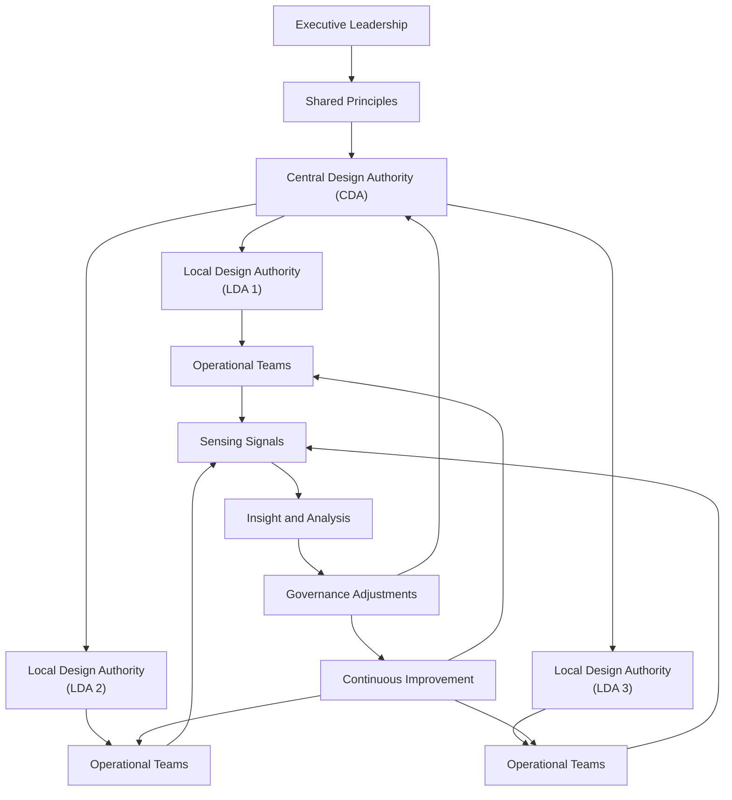
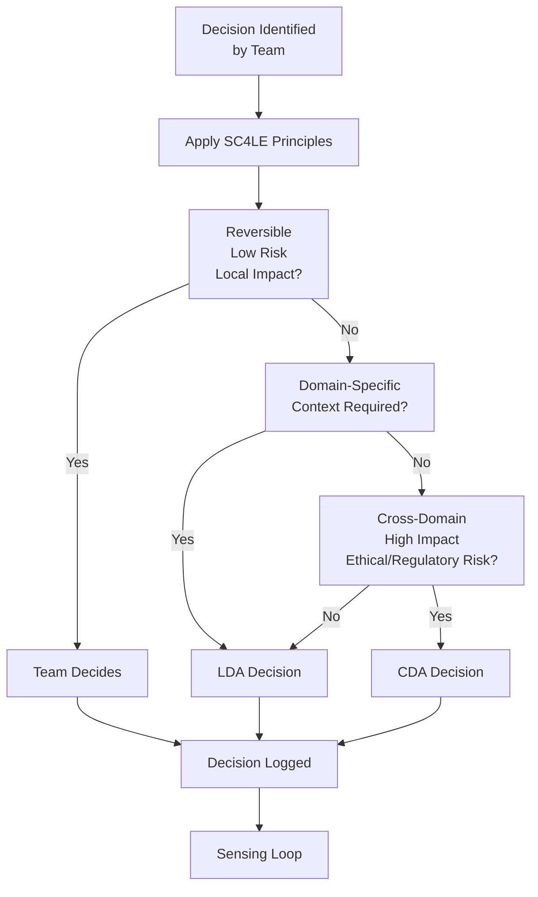
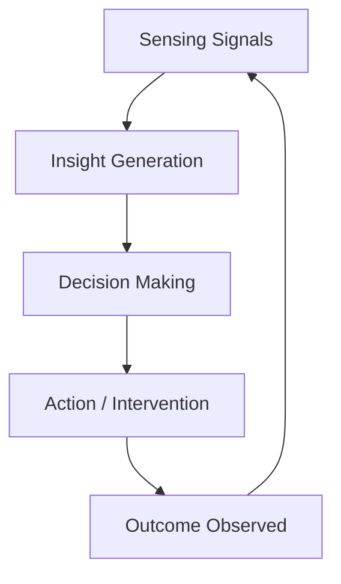

# SC4LE Diagrams Library (Master File)

This master file provides a single reference point for all SC4LE diagrams, including:
- GitHub‑safe Mermaid diagrams  
- Image‑based diagrams (EPA versions + upgraded SC4LE versions)  
- Links to individual diagram files  

All Mermaid diagrams use minimal styling for maximum GitHub compatibility.

---

# 1. Governance Architecture Diagram (Mermaid)

This diagram shows how governance flows through the SC4LE federated model:  
Executive Leadership → Shared Principles → CDA → LDAs → Operational Teams → Sensing → Improvement.



---

# 2. Decision Pathway Diagram (Mermaid)

This diagram shows how decisions move through Teams → LDAs → CDA, based on reversibility, risk, impact, and ethical/regulatory thresholds.



---

# 3. Sensing Loop Diagram (Mermaid)

This diagram shows the continuous sensing cycle:  
Sensing → Insight → Decision → Action → Outcome → Sensing.



---

# 4. Image-Based Diagrams (EPA Versions + Upgraded SC4LE Versions)

The following diagrams exist in **two styles**:
- **Monochrome (consulting-grade)**  
- **SC4LE Brand Colour (Deep Teal + Charcoal)**  

And in **two conceptual versions**:
- **EPA-faithful version**  
- **Upgraded SC4LE version**  

## 4.1 Operating Model Diagrams

### EPA Version
- `/diagrams/images/epa/operating-model-epa-mono.png`
- `/diagrams/images/epa/operating-model-epa-colour.png`

### SC4LE Upgraded Version
- `/diagrams/images/sc4le/operating-model-sc4le-mono.png`
- `/diagrams/images/sc4le/operating-model-sc4le-colour.png`

---

## 4.2 Ecosystem Diagrams

### EPA Version
- `/diagrams/images/epa/ecosystem-epa-mono.png`
- `/diagrams/images/epa/ecosystem-epa-colour.png`

### SC4LE Upgraded Version
- `/diagrams/images/sc4le/ecosystem-sc4le-mono.png`
- `/diagrams/images/sc4le/ecosystem-sc4le-colour.png`

---

## 4.3 Enablement Cycle Diagrams

### EPA Version
- `/diagrams/images/epa/enablement-cycle-epa-mono.png`
- `/diagrams/images/epa/enablement-cycle-epa-colour.png`

### SC4LE Upgraded Version
- `/diagrams/images/sc4le/enablement-cycle-sc4le-mono.png`
- `/diagrams/images/sc4le/enablement-cycle-sc4le-colour.png`

---

# 5. Links to Individual Diagram Files

- `/diagrams/governance-architecture.md`
- `/diagrams/decision-pathway.md`
- `/diagrams/sensing-loop.md`
- `/diagrams/operating-model.md`
- `/diagrams/ecosystem.md`
- `/diagrams/enablement-cycle.md`

---

# 6. Notes

- Mermaid diagrams are GitHub‑safe and minimal.  
- Image diagrams exist in both EPA and upgraded SC4LE versions.  
- Colour diagrams use the SC4LE palette:  
  - Teal `#009CA6`  
  - Charcoal `#1A1A1A`  
  - White `#FFFFFF`  
  - Optional accent `#0066CC`  

```
