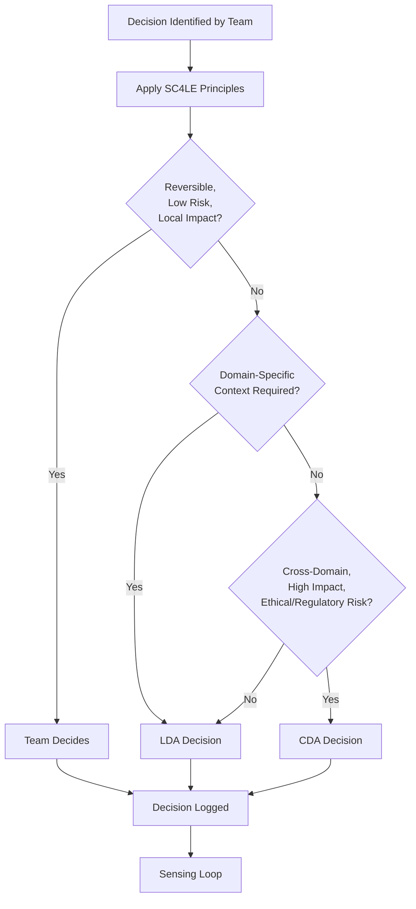

# SC4LE Decision Pathway Diagram

This diagram shows how decisions move through Teams → LDAs → CDA, based on reversibility, risk, impact, and ethical/regulatory thresholds.

```mermaid
flowchart TD

    A[Decision Identified by Team] --> B[Apply SC4LE Principles]

    B --> C{Reversible,<br/>Low Risk,<br/>Local Impact?}
    C -->|Yes| D[Team Decides]
    C -->|No| E{Domain-Specific<br/>Context Required?}

    E -->|Yes| F[LDA Decision]
    E -->|No| G{Cross-Domain,<br/>High Impact,<br/>Ethical/Regulatory Risk?}

    G -->|Yes| H[CDA Decision]
    G -->|No| F

    %% Logging + Sensing
    D --> I[Decision Logged]
    F --> I
    H --> I

    I --> J[Sensing Loop]
```
