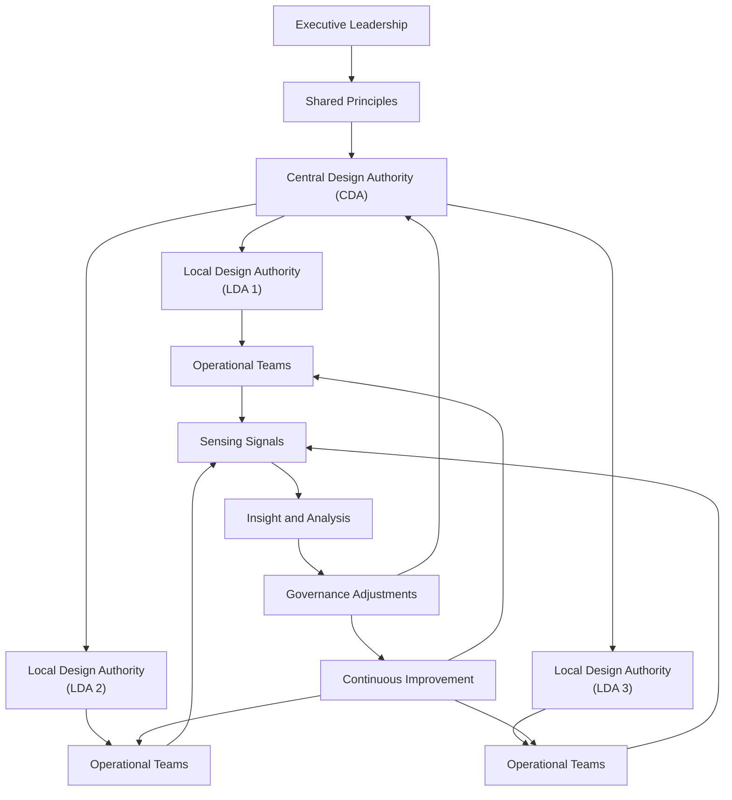

# SC4LE Governance Architecture Diagram

This diagram shows how governance flows through the SC4LE federated model:  
Executive Leadership → Shared Principles → CDA → LDAs → Operational Teams → Sensing → Improvement.

